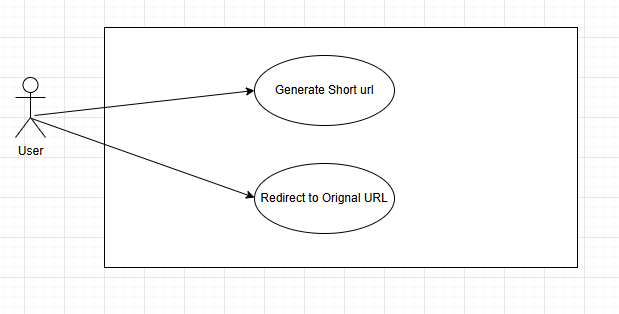

# url-shortener-service
Cloud native URL shortener service

#Goal:
url-shortener-service is a Cloud based Service to genrate short url form givin url.
User will provide URL as input to system and system will genrate and return short url to user
All short url must be unquie. When user click short url it must redirect to Orignal url.

#Possible Basic use case :
1. for given  url return shortend url
2. gien short url redirect to original url
3. High Avalbily, Scalabilty and fault tolerance

#Use Case Diagram:

